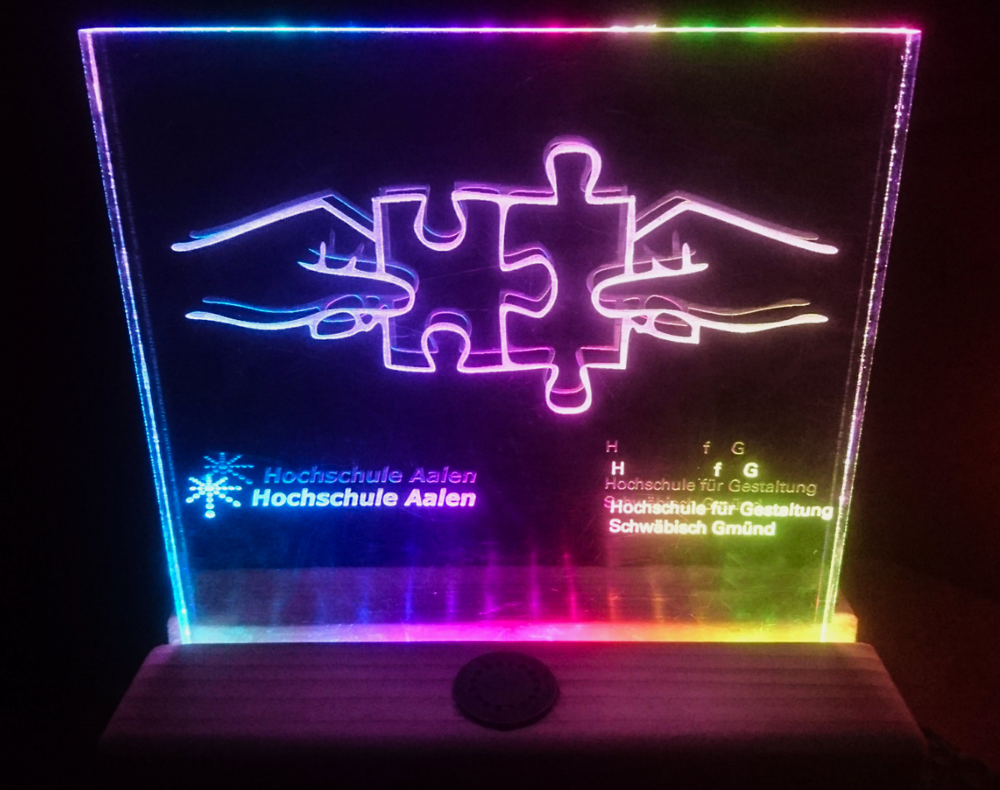

# RainbowWarrior

*HfG Schwäbisch Gmünd in cooperation with Hochschule Aalen  
Internet of Things  
Semester 3, Embedded Systems - with Prof. Dr.-Ing. Jürgen Schüle*

*by Christina Rost, 2018*

## DIY Fancy Light with Alarm and several LED Animations
### Requirements

- ESP82 Development Board  
- WS2812b or sk6812 adressable LED strip
- piezo speaker
- photosensor
- acrylic glass
- wood or something you can use as a stand

Complete coding and building instructions, for absolute beginners, with detailed explanations in [instructions.pdf](instructions.pdf "Instructions")

Get the corresponding Micropython port here:
https://github.com/loboris/MicroPython_ESP32_psRAM_LoBo

